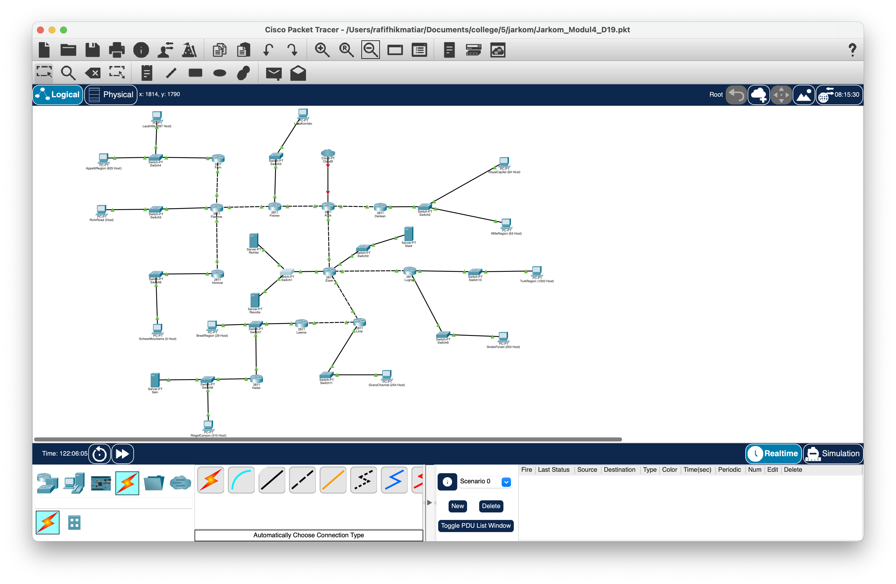
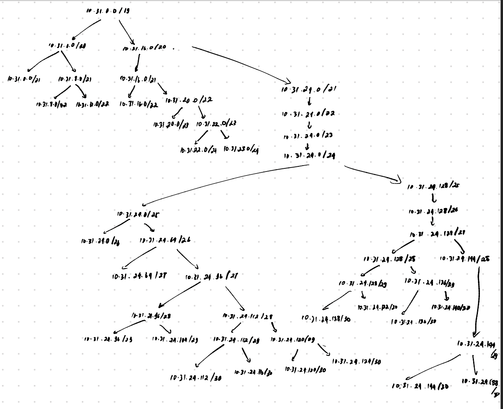
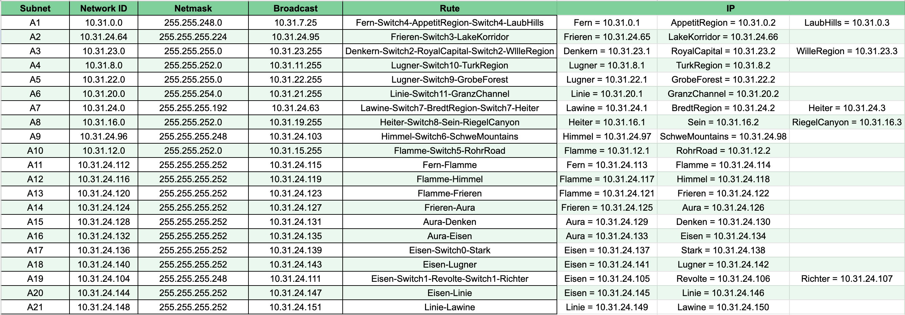

# Jarkom-Modul-4-D19-2023

Anggota:
| Nama | NRP |
|---------------------------|------------|
|Adrian Ismu Arifianto | 5025211116 |
|Ahmad Rafif Hikmatiar | 5025211247 |

## CPT VLSM



#### <i>Subnetting</i>
Untuk langkah selanjutnya, kita lakukan <i>subnetting</i>
untuk mengetahui setiap ip nya. Langkah pertama yang harus dilakukan adalah menggambar atau membuat vlsm-tree. Berikut adalah vlsm-tree yang sudah saya buat:



Setelah kita membuat vlsm-tree, kita lakukan <i>subnetting</i> pada setiap rute yang telah ditentukan dengan tabel berikut:



#### <i>Routing</i>

## GNS3 CIDR

### Topologi


### Pembagian Subnet


### Penggabungan Subnet
#### Penggabungan Subnet 1


#### Penggabungan Subnet 2


#### Penggabungan Subnet 3


#### Penggabungan Subnet 4


#### Penggabungan Subnet 5


#### Penggabungan Subnet 6


#### Penggabungan Subnet 7


#### Penggabungan Subnet 8


#### Penggabungan Subnet 9


#### Penggabungan Subnet 10


### CIDR Tree


### Pembagian IP CIDR

| Subnet | Network ID  | Netmask         | Broadcast      | Gabungan                                               |
|--------|-------------|-----------------|----------------|--------------------------------------------------------|
| A1     | 10.31.16.0  | 255.255.248.0   | 10.31.23.255   | Fern-Switch4-AppetitRegion-Switch4-LaubHills          |
| A2     | 10.55.128.0 | 255.255.255.224 | 10.55.128.31   | Frieren-Switch3-LakeKorridor                          |
| A3     | 10.39.0.0   | 255.255.255.128 | 10.39.0.127    | Denkern-Switch2-RoyalCapital-Switch2-WllleRegion       |
| A4     | 10.57.0.0   | 255.255.252.0   | 10.57.3.255    | Lugner-Switch10-TurkRegion                            |
| A5     | 10.56.0.0   | 255.255.255.0   | 10.56.0.255    | Lugner-Switch9-GrobeForest                            |
| A6     | 10.55.16.0  | 255.255.254.0   | 10.55.17.255   | Linie-Switch11-GranzChannel                           |
| A7     | 10.55.0.0   | 255.255.255.192 | 10.55.0.63     | Lawine-Switch7-BredtRegion-Switch7-Heiter             |
| A8     | 10.55.4.0   | 255.255.252.0   | 10.55.7.255    | Heiter-Switch8-Sein-RiegelCanyon                      |
| A9     | 10.31.4.0   | 255.255.255.248 | 10.31.4.7      | Himmel-Switch6-SchweMountains                         |
| A10    | 10.31.0.0   | 255.255.252.0   | 10.31.3.255    | Flamme-Switch5-RohrRoad                               |
| A11    | 10.31.8.0   | 255.255.255.252 | 10.31.8.3      | Fern-Flamme                                           |
| A12    | 10.31.4.4   | 255.255.255.252 | 10.31.4.7      | Flamme-Himmel                                         |
| A13    | 10.31.32.0  | 255.255.255.252 | 10.31.32.3     | Flamme-Frieren                                        |
| A14    | 10.31.128.0 | 255.255.255.252 | 10.31.128.3    | Frieren-Aura                                          |
| A15    | 10.33.0.0   | 255.255.255.252 | 10.33.0.3      | Aura-Denken                                           |
| A16    | 10.32.0.0   | 255.255.255.252 | 10.32.0.3      | Aura-Eisen                                            |
| A17    | 10.59.0.0   | 255.255.255.252 | 10.59.0.3      | Eisen-Switch0-Stark                                   |
| A18    | 10.31.64.0  | 255.255.255.252 | 10.31.64.3     | Eisen-Lugner                                          |
| A19    | 10.55.64.0  | 255.255.255.248 | 10.55.64.7     | Eisen-Switch1-Revolte-Switch1-Richter                 |
| A20    | 10.55.32.0  | 255.255.255.252 | 10.55.32.3     | Eisen-Linie                                           |
| A21    | 10.55.8.0   | 255.255.255.252 | 10.55.8.3      | Linie-Lawine                                          |


### Config CIDR pada GNS3

Berikut merupakan config pada setiap node berdasarkan IP yang sudah didapatkan pada pembagian IP CIDR

#### AppetitRegion
```
auto eth0
iface eth0 inet static
	address 10.31.16.2
	netmask 255.255.248.0
	gateway 10.31.16.1
```
#### LaubHills
```
auto eth0
iface eth0 inet static
	address 10.31.16.3
	netmask 255.255.248.0
	gateway 10.31.16.1
```

#### Fern
```
auto eth0
iface eth0 inet static
	address 10.31.8.1
	netmask 255.255.255.252

auto eth1
iface eth1 inet static
	address 10.31.16.1
	netmask 255.255.248.0
```

#### Flamme
```
auto eth0
iface eth0 inet static
	address 10.31.32.1
	netmask 255.255.255.252

auto eth1
iface eth1 inet static
	address 10.31.8.2
	netmask 255.255.255.252

auto eth2
iface eth2 inet static
	address 10.31.0.1
	netmask 255.255.252.0

auto eth3
iface eth3 inet static
	address 10.31.4.5
	netmask 255.255.255.252    
```

#### RohrRoad
```
auto eth0
iface eth0 inet static
	address 10.31.0.2
	netmask 255.255.252.0
	gateway 10.31.0.1
```

#### Himmel
```
auto eth0
iface eth0 inet static
	address 10.31.4.6
	netmask 255.255.255.252

auto eth1
iface eth1 inet static
	address 10.31.4.1
	netmask 255.255.255.248
```

#### SchwerMountain
```
auto eth0
iface eth0 inet static
	address 10.31.4.2
	netmask 255.255.255.248
	gateway 10.31.4.1
```

#### Frieren
```
auto eth0
iface eth0 inet static
	address 10.31.128.1
	netmask 255.255.255.252

auto eth2
iface eth2 inet static
	address 10.31.32.2
	netmask 255.255.255.252

auto eth1
iface eth1 inet static
	address 10.55.128.2
	netmask 255.255.255.224

```

#### LakeKorridor
```
auto eth0
iface eth0 inet static
	address 10.55.128.2
	netmask 255.255.255.224
	gateway 10.55.128.1
```

#### Aura
```
auto eth0
iface eth0 inet dhcp

auto eth1
iface eth1 inet static
	address 10.33.0.1
	netmask 255.255.255.252

auto eth2
iface eth2 inet static
	address 10.31.128.2
	netmask 255.255.255.224

auto eth3
iface eth3 inet static
	address 10.32.0.1
	netmask 255.255.255.252
```

#### Denken
```
auto eth0
iface eth0 inet static
	address 10.33.0.2
	netmask 255.255.255.252

auto eth1
iface eth1 inet static
	address 10.39.0.1
	netmask 255.255.255.128
```

#### RoyalCapital
```
auto eth0
iface eth0 inet static
	address 10.39.0.2
	netmask 255.255.255.128
	gateway 10.39.0.1
```

#### WilleRegion
```
auto eth0
iface eth0 inet static
	address 10.39.0.3
	netmask 255.255.255.128
	gateway 10.39.0.1
```

#### Eisen
```
auto eth0
iface eth0 inet static
	address 10.32.0.2
	netmask 255.255.255.252

auto eth1
iface eth1 inet static
	address 10.59.0.1
	netmask 255.255.255.252

auto eth2
iface eth2 inet static
	address 10.55.64.1
	netmask 255.255.255.248

auto eth3
iface eth3 inet static
	address 10.31.64.1
	netmask 255.255.255.252

auto eth4
iface eth4 inet static
	address 10.55.32.1
	netmask 255.255.255.252
```

#### Stark
```
auto eth0
iface eth0 inet static
	address 10.59.0.2
	netmask 255.255.255.252
	gateway 10.59.0.1
```

#### Revolte
```
auto eth0
iface eth0 inet static
	address 10.55.64.3
	netmask 255.255.255.248
	gateway 10.55.64.1
```

#### Richter
```
auto eth0
iface eth0 inet static
	address 10.55.64.2
	netmask 255.255.255.248
	gateway 10.55.64.1
```

#### Lugner
```
auto eth0
iface eth0 inet static
	address 10.31.64.2
	netmask 255.255.255.252

auto eth1
iface eth1 inet static
	address 10.56.0.1
	netmask 255.255.255.0

auto eth2
iface eth2 inet static
	address 10.57.0.1
	netmask 255.255.252.0
```

#### TurkRegion
```
auto eth0
iface eth0 inet static
	address 10.57.0.2
	netmask 255.255.252.0
	gateway 10.57.0.1
```

#### GrobeForest
```
auto eth0
iface eth0 inet static
	address 10.56.0.2
	netmask 255.255.255.0
	gateway 10.56.0.1
```

#### GranzChanel
```
auto eth0
iface eth0 inet static
	address 10.55.16.2
	netmask 255.255.252.0
	gateway 10.55.16.1
```


#### Linie
```
auto eth0
iface eth0 inet static
	address 10.55.32.2
	netmask 255.255.255.252

auto eth1
iface eth1 inet static
	address 10.55.8.1
	netmask 255.255.255.252

auto eth2
iface eth2 inet static
	address 10.55.16.1
	netmask 255.255.254.0
```

#### Lawine
```
auto eth0
iface eth0 inet static
	address 10.55.8.2
	netmask 255.255.255.252

auto eth1
iface eth1 inet static
	address 10.55.0.1
	netmask 255.255.255.192
```

#### BredRegion
```
auto eth0
iface eth0 inet static
	address 10.55.0.3
	netmask 255.255.255.192
	gateway 10.55.0.1
```

#### Heiter
```
auto eth0
iface eth0 inet static
	address 10.55.0.2
	netmask 255.255.255.192

auto eth1
iface eth1 inet static
	address 10.55.4.1
	netmask 255.255.252.0
```

#### Sein
```
auto eth0
iface eth0 inet static
	address 10.55.4.2
	netmask 255.255.252.0
	gateway 10.55.4.1
```

#### RiegelCanyon
```
auto eth0
iface eth0 inet static
	address 10.55.4.3
	netmask 255.255.252.0
	gateway 10.55.4.1
```

### Routing CIDR pada GNS3

Berikut merupakan cara melakukan routing CIDR pada GNS3 dengan menggunakan `route add -net <NID subnet> netmask <netmask> gw <IP gateway>`

#### Aura
```bash
route add -net 10.31.32.0 netmask 255.255.255.252 gw 10.31.128.1 #A13

route add -net 10.55.128.0 netmask 255.255.255.224 gw 10.31.128.1 #A2

route add -net 10.31.8.0 netmask 255.255.255.252 gw 10.31.128.1 #A11

route add -net 10.31.16.0 netmask 255.255.248.0 gw 10.31.128.1 #A1

route add -net 10.31.0.0 netmask 255.255.252.0 gw 10.31.128.1 #A10

route add -net 10.31.4.4 netmask 255.255.255.252 gw 10.31.128.1 #A12

route add -net 10.31.4.0 netmask 255.255.255.248 gw 10.31.128.1 #A9


route add -net 10.39.0.0 netmask 255.255.255.128 gw 10.33.0.2 #A3


route add -net 10.59.0.0 netmask 255.255.255.252 gw 10.32.0.2 #A17

route add -net 10.31.64.0 netmask 255.255.255.252 gw 10.32.0.2 #A18
```

#### Frieren
```bash
route add -net 0.0.0.0 netmask 0.0.0.0 gw 10.31.128.2

route add -net 10.31.8.0 netmask 255.255.255.252 gw 10.31.32.1

route add -net 10.31.4.4 netmask 255.255.255.252 gw 10.31.32.1

route add -net 10.31.4.0 netmask 255.255.255.248 gw 10.31.32.1

route add -net 10.31.0.0 netmask 255.255.252.0 gw 10.31.32.1

route add -net 10.31.16.0 netmask 255.255.248.0 gw 10.31.32.1
```

#### Flamme
```bash
route add -net 0.0.0.0 netmask 0.0.0.0 gw 10.31.32.2

route add -net 10.31.16.0 netmask 255.255.248.0 gw 10.31.8.1

route add -net 10.31.4.0 netmask 0.0.0.0 gw 10.31.4.6
```

#### Fern
```bash
route add -net 0.0.0.0 netmask 0.0.0.0 gw 10.31.8.2
```

#### Himmel
```bash
route add -net 0.0.0.0 netmask 0.0.0.0 gw 10.31.4.5
```

#### Denken
```bash
route add -net 0.0.0.0 netmask 0.0.0.0 gw 10.33.0.1
```

#### Eisen
```bash
route add -net 0.0.0.0 netmask 0.0.0.0 gw 10.32.0.1

route add -net 10.57.0.0 netmask 255.255.252.0 gw 10.31.64.2

route add -net 10.56.0.0 netmask 255.255.255.0 gw 10.31.64.2

route add -net 10.55.16.0 netmask 255.255.254.0 gw 10.55.32.2

route add -net 10.55.8.0 netmask 255.255.255.252 gw 10.55.32.2

route add -net 10.55.0.0 netmask 255.255.255.192 gw 10.55.32.2

route add -net 10.55.4.0 netmask 255.255.252.0 gw 10.55.32.2
```

#### Lugner
```bash
route add -net 0.0.0.0 netmask 0.0.0.0 gw 10.31.64.1
```

#### Linie
```bash
route add -net 0.0.0.0 netmask 0.0.0.0 gw 10.55.32.1

route add -net 10.55.0.0 netmask 255.255.255.192 gw 10.55.8.2

route add -net 10.55.4.0 netmask 255.255.252.0 gw 10.55.8.2
```

#### Lawine
```bash
route add -net 0.0.0.0 netmask 0.0.0.0 gw 10.55.8.1

route add -net 10.55.4.0 netmask 255.255.252.0 gw 10.55.0.2

```

#### Heiter
```bash
route add -net 0.0.0.0 netmask 0.0.0.0 gw 10.55.0.1
```


